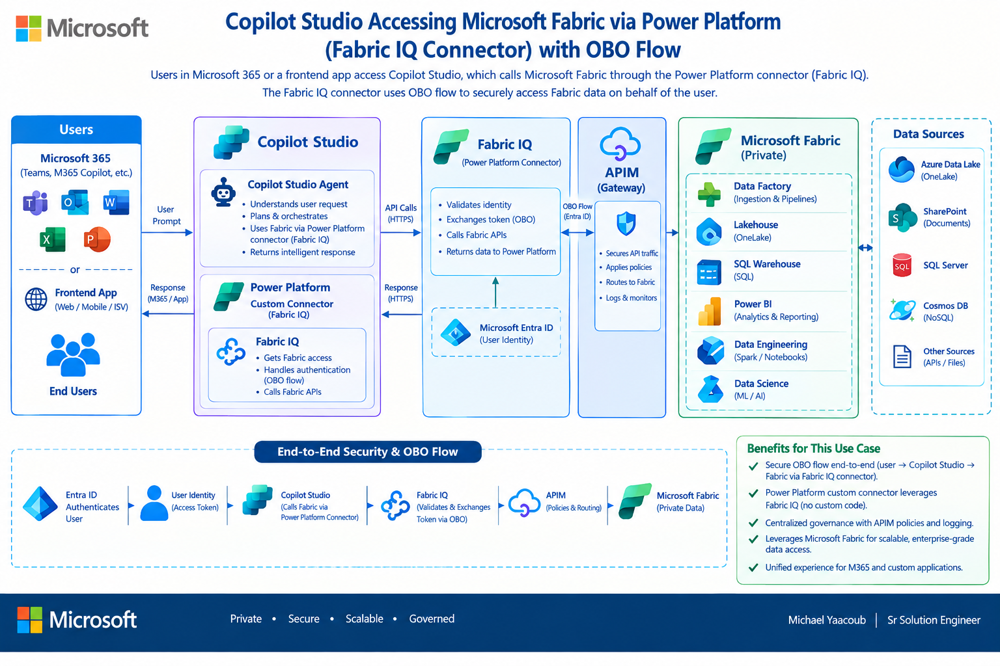
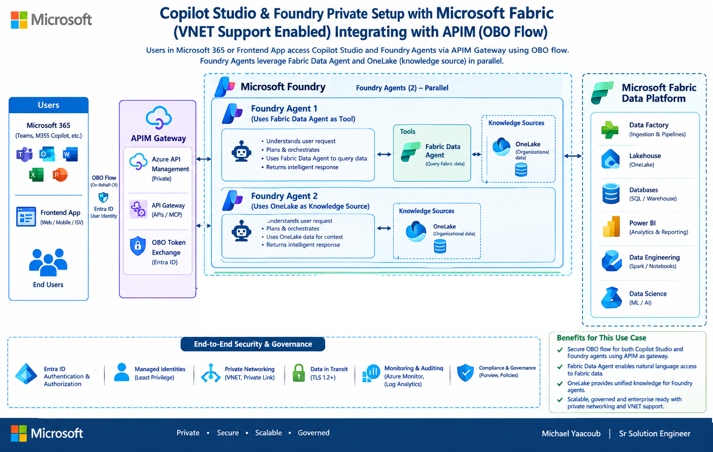

# Microsoft Foundry & Copilot Studio Private Fabric OBO Gateway

Enterprise On-Behalf-Of (OBO) integration gateway connecting **Microsoft Foundry** prompt agents and **Microsoft Copilot Studio** conversational agents to **Microsoft Fabric** Lakehouse tables and Fabric Data Agents under caller-delegated Microsoft Entra ID identity.

**Table of contents**

- [Architecture overview](#architecture-overview)
- [Repository structure](#repository-structure)
- [Getting started](#getting-started)
- [Deployment](#deployment)
- [Runbooks and detailed guides](#runbooks-and-detailed-guides)
- [Fabric UI reference](#fabric-ui-reference)
- [License](#license)

---

## Architecture Overview

The following diagrams show the two supported private integration patterns and how user identity is preserved when agents access Microsoft Fabric.

### Copilot Studio OBO Flow



Users enter through Microsoft 365 or a frontend application and interact with a Copilot Studio agent. The Fabric IQ Power Platform connector validates the caller's Microsoft Entra identity, performs the OBO token exchange, and sends the delegated request through APIM. APIM applies centralized security, routing, and monitoring policies before the request reaches private Fabric services and their connected data sources.

### Private Copilot Studio and Foundry Integration



Private APIM provides the governed gateway for both Copilot Studio and Microsoft Foundry. Foundry agents use two complementary Fabric patterns in parallel: the Fabric Data Agent provides natural-language access to governed data, while OneLake supplies organizational knowledge for grounded responses. Entra OBO, managed identities, private networking, transport encryption, monitoring, and governance controls protect the end-to-end flow.

### Core Capabilities

1. **Microsoft Foundry First-Class Agent Integrations**:
   - **Lakehouse Knowledge**: Integrated as native Foundry IQ OneLake Knowledge source (`knowledge_base_retrieve`) using approved vector search snapshots, with APIM MCP tool fallback (`tables`, `query`).
   - **Data Agent Tool**: Integrated as native Fabric Data Agent tool (`fabric_dataagent_preview`), enabling conversational queries over Fabric operational data.

2. **Copilot Studio Private OBO Integration**:
   - **Fabric Lakehouse Analyst**: Custom knowledge pattern using the `OnKnowledgeRequested` trigger to query `POST /fabric-lakehouse/knowledge`.
   - **Fabric Data Agent Analyst**: Invoker-authenticated action using solution-aware custom connectors (`caldova_FabricDataAgentAnalyst`) requiring interactive end-user consent.

3. **Enterprise Zero-Trust Security**:
   - Private network isolation (`caldova-apim-westus-vnet` with `caldova-dbx-vnet-westus2` peering).
   - Strict MSAL Node OBO token exchange preserving user identity and permissions down to Fabric SQL Endpoint and Fabric REST APIs.
   - Fail-closed token validation and sanitized diagnostics.

---

## Repository Structure

```
.
├── agents/                     # Agent specifications and definitions
│   ├── data-agent/             # Copilot Studio Fabric Data Agent solution
│   ├── foundry/                # Foundry prompt agent instructions
│   └── lakehouse/              # Copilot Studio Fabric Lakehouse solution
├── apim/                       # Azure API Management gateway configurations
│   ├── openapi/                # OpenAPI 3.0 / Swagger 2.0 schemas
│   │   ├── data-agent.json     # Fabric Data Agent OBO API specification
│   │   └── lakehouse.json      # Fabric Lakehouse OBO API specification
│   └── policies/               # XML gateway runtime policies
│       ├── data-agent-query-operation-policy.xml
│       ├── fabric-obo-api-policy.xml
│       ├── foundry-inference-policy.xml
│       ├── lakehouse-query-operation-policy.xml
│       └── lakehouse-tables-operation-policy.xml
├── bicep/                      # Infrastructure as Code (Azure Bicep)
│   ├── apim/                   # APIM service and API stack definitions
│   ├── broker/                 # Function App broker and Key Vault
│   ├── foundry/                # Foundry project connections
│   ├── network-apim-side/      # APIM networking and subnets
│   └── network-broker-side/    # Broker networking and private endpoints
├── config/
│   └── deployment.json         # Unified configuration contract
├── docs/                       # Runbooks and architecture documentation
│   ├── copilot-studio-private-obo.md  # Copilot Studio runbook
│   ├── foundry-obo.md                 # Microsoft Foundry runbook
│   └── images/                 # Architecture diagrams and UI screenshots
├── functions/
│   └── obo-broker/             # TypeScript Azure Functions v4 broker
│       ├── src/
│       │   ├── auth.ts         # Entra token validation
│       │   ├── config.ts       # Environment settings
│       │   ├── errors.ts       # Structured error handling
│       │   ├── mcp.ts          # Model Context Protocol bridge
│       │   ├── obo.ts          # MSAL OBO token exchange
│       │   ├── sql.ts          # TDS Fabric SQL Endpoint connector
│       │   └── functions/http.ts # HTTP routing endpoints
│       └── test/               # Node test suite (23 unit tests)
├── scripts/                    # Deployment, validation, and provisioning scripts
│   ├── build-broker-package.ps1 # Builds Function App deployment zip
│   ├── config.ps1              # Configuration parser and assertions
│   ├── create-connectors.ps1   # Power Platform custom connector provisioner
│   ├── deploy.ps1              # Orchestrated Azure deployment script
│   ├── package-agents.ps1      # PAC CLI agent solution packager
│   ├── provision-copilot-studio-agents.ps1 # Copilot Studio orchestrator
│   ├── provision-foundry-agents.ps1       # Foundry prompt agent orchestrator
│   └── validate.ps1            # Comprehensive pre-flight validation
├── skills/                     # Domain-specific skill prompts
└── terraform/                  # Terraform IaC modules mirroring Bicep
```

---

## Getting Started

### Prerequisites

- **PowerShell 7.4+**
- **Azure CLI (`az`)** with `bicep` and `account` extensions
- **Node.js 22 LTS** (`>=22 <23`) & npm
- **Python 3.11+** with `azure-ai-projects==2.4.0` and `azure-identity`
- **Power Platform CLI (`pac`)**
- Access to:
  - Azure Subscription: `cf824570-a8ba-497a-a184-0a52f1830aa9`
  - Tenant ID: `12a4b86b-e64c-43f9-af05-d9130a72dfd2`
  - Power Platform Environment: `52456fcd-1d20-ecdb-aa2e-8979e3f794f5` (`Caldova Private`)
  - Fabric Capacity: `37fcefa2-236a-47c0-a528-2c80137dfec0` (`caldovafabricmyaacoub`)

### Validation

Run pre-deployment contract and code verification:

```powershell
.\scripts\validate.ps1 -SkipTerraformInit
```

Checks validated:
- JSON schema and configuration constraints
- TypeScript compilation and 23 broker unit tests
- Dependency security audit (`npm audit --omit=dev`)
- Power Platform solution packaging and schema integrity
- APIM OpenAPI specifications and XML policy syntax
- Bicep template syntax and linter rules
- Terraform configuration validation

---

## Deployment

Deploy using `scripts/deploy.ps1`:

```powershell
# 1. Run preflight checks
.\scripts\deploy.ps1 -Step preflight

# 2. Package and deploy broker Function App
.\scripts\deploy.ps1 -Step broker-app

# 3. Configure APIM APIs and policies
.\scripts\deploy.ps1 -Step apim

# 4. Provision Microsoft Foundry connections and agents
.\scripts\deploy.ps1 -Step foundry-connections
.\scripts\deploy.ps1 -Step foundry-agents

# 5. Provision Copilot Studio custom connectors and import agent solutions
.\scripts\deploy.ps1 -Step copilot-studio
```

---

## Runbooks and Detailed Guides

- **Microsoft Foundry**: Refer to [docs/foundry-obo.md](docs/foundry-obo.md) for step-by-step setup of Foundry IQ OneLake Knowledge, Fabric Data Agent tools, APIM OAuth connections, and agent orchestration.
- **Microsoft Copilot Studio**: Refer to [docs/copilot-studio-private-obo.md](docs/copilot-studio-private-obo.md) for custom connector creation, maker connection authentication, solution import, invoker consent flow, and troubleshooting.

---

## Fabric UI Reference

These screenshots show the Microsoft Fabric assets used by the reference deployment after provisioning.

### Lakehouse


The `lh_part_shortages_v2` Lakehouse contains the governed tables and files used by the agents. Its `Files` area supplies approved content to Foundry IQ OneLake Knowledge, while its tables remain available through Fabric SQL endpoints.

### Data Agent


The published `agent_part_shortages` Data Agent provides the conversational semantic layer over selected Lakehouse schemas and tables.

---

## License

This project is licensed under the MIT License - see the [LICENSE](LICENSE) file for details.
