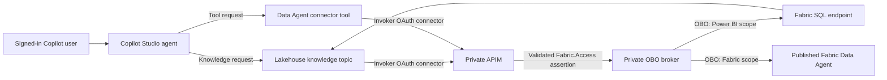

# Copilot Studio private OBO runbook

This runbook creates two agents in the **Caldova Private** Copilot Studio environment:

- **Fabric Parts Shortages Analyst:** private Lakehouse data exposed as a custom knowledge source.
- **Fabric Data Agent Analyst:** the published Fabric Data Agent exposed as a connector tool.

Both paths use the signed-in user's identity through private APIM and the OBO broker. No maker or service-principal identity is accepted as a fallback for Fabric data access.

## Table of contents

- [Architecture](#architecture)
- [Prerequisites](#prerequisites)
- [1. Deploy the private OBO foundation](#1-deploy-the-private-obo-foundation)
- [2. Provision connector identities](#2-provision-connector-identities)
- [3. Create the OBO custom connectors](#3-create-the-obo-custom-connectors)
- [4. Import the two agent baselines](#4-import-the-two-agent-baselines)
- [5. Bind Lakehouse as knowledge](#5-bind-lakehouse-as-knowledge)
- [6. Bind the Fabric Data Agent as a tool](#6-bind-the-fabric-data-agent-as-a-tool)
- [7. Pull, validate, and publish](#7-pull-validate-and-publish)
- [8. Acceptance tests](#8-acceptance-tests)
- [APIM policy reference](#apim-policy-reference)
- [Troubleshooting](#troubleshooting)
- [Screenshot checklist](#screenshot-checklist)
- [Microsoft Learn references](#microsoft-learn-references)

## Architecture



The Power Platform VNet enterprise policy supplies network reachability to private APIM. The custom connector supplies delegated OAuth. Both are required.

## Prerequisites

1. A Managed Power Platform environment with Dataverse.
2. The environment linked to the Power Platform VNet support enterprise policy.
3. Private APIM DNS resolvable from the injected subnets.
4. A published Fabric Data Agent and an active Fabric capacity.
5. The allowed user has access to the Lakehouse, Data Agent, and underlying data.
6. Azure CLI is signed into tenant `12a4b86b-e64c-43f9-af05-d9130a72dfd2`.
7. PAC CLI is authenticated to `https://orgadfd9fe9.crm3.dynamics.com`.

Create the PAC profile interactively:

```powershell
pac auth create `
  --name caldova-private `
  --tenant 12a4b86b-e64c-43f9-af05-d9130a72dfd2 `
  --environment https://orgadfd9fe9.crm3.dynamics.com `
  --deviceCode
pac auth select --name caldova-private
pac org who --environment https://orgadfd9fe9.crm3.dynamics.com
```

## 1. Deploy the private OBO foundation

Deploy and validate the broker and APIM before authoring agents:

```powershell
pwsh scripts/validate.ps1 -DeploymentReady -IncludeParity
pwsh scripts/deploy.ps1 -Step broker-base
pwsh scripts/deploy.ps1 -Step identity
pwsh scripts/deploy.ps1 -Step package
pwsh scripts/deploy.ps1 -Step broker-app
pwsh scripts/deploy.ps1 -Step apim
```

The Lakehouse API exposes:

- `POST /fabric-lakehouse/knowledge`: bounded citation-ready knowledge search.
- `POST /fabric-lakehouse/query`: one validated read-only SQL statement.
- `GET /fabric-lakehouse/tables`: visible table discovery.

The Data Agent API exposes:

- `POST /fabric-data-agent/query`: one natural-language question to the published Fabric Data Agent.

The Lakehouse knowledge endpoint accepts only a search query. It builds parameterized SQL in the broker and returns at most 15 `{snippet,title,url}` records; callers cannot supply SQL.

## 2. Provision connector identities

Run the identity provisioner before creating connectors:

```powershell
pwsh scripts/provision-identity.ps1 `
  -KeyVaultName kv-caldova-fabric-obo-fn `
  -DeploymentReady
```

It creates or reconciles:

1. The resource API exposing delegated `Fabric.Access`.
2. One Entra client for each Power Platform custom connector.
3. Principal-scoped consent for the configured allowed users.
4. Delegated Fabric permissions on the resource API.
5. The APIM-to-broker application role.
6. The broker client credential stored directly in private Key Vault.

Never put client secrets in source, generated JSON, screenshots, or command output.

## 3. Create the OBO custom connectors

Generate definitions without mutation:

```powershell
pwsh scripts/create-connectors.ps1 -DefinitionOnly
```

Create or validate both connectors:

```powershell
pwsh scripts/provision-copilot-studio-agents.ps1 -ProvisionConnectors
```

The connector configuration must contain:

| Setting | Required value |
| --- | --- |
| Authentication | OAuth 2.0 / Microsoft Entra ID |
| Resource URL | `api://<resource-api-client-id>` |
| Scope | `Fabric.Access` |
| Enable on-behalf-of login | `True` |
| Connection owner | Each invoking user |
| Backend | Private APIM REST API |

The script creates Swagger 2.0 definitions with typed request bodies. It does not use an APIM subscription key as the user identity.


After the user grants consent, subsequent connector calls use the delegated connection:


## 4. Import the two agent baselines

Build and inspect the source packages:

```powershell
pwsh scripts/package-agents.ps1
```

Import both baselines after PAC is connected to the correct environment:

```powershell
pwsh scripts/provision-copilot-studio-agents.ps1 -ImportBaselines
```

After the identity metadata is current, the deployment orchestrator can provision both connectors and import both baselines in one guarded stage:

```powershell
pwsh scripts/deploy.ps1 -Step copilot-studio -WhatIf
pwsh scripts/deploy.ps1 -Step copilot-studio -CurrentDeployerPrincipalId <object-id>
```

The live command still stops before publication. Maker-created connection references must be bound and pulled first.

The command imports:

| Agent | Schema name | Intended binding |
| --- | --- | --- |
| Fabric Parts Shortages Analyst | `caldova_fabricPartsShortagesAnalyst` | Lakehouse custom knowledge only |
| Fabric Data Agent Analyst | `caldova_fabricDataAgentAnalyst` | Data Agent query tool only |

## 5. Bind Lakehouse as knowledge

Connector actions require a maker-authenticated connection reference, so perform this binding once in Copilot Studio and pull it back into source.

1. Open **Fabric Parts Shortages Analyst**.
2. Add the **Fabric Lakehouse OBO Private** custom connector.
3. Select its **Search open Lakehouse shortages** (`knowledge`) operation.
4. Configure credentials as **User / Invoker**, never maker-provided.
5. Create a topic and switch to code view.
6. Start from [private-lakehouse-knowledge.topic.mcs.yml](../agents/lakehouse/templates/private-lakehouse-knowledge.topic.mcs.yml).
7. Replace `__CONNECTOR_LOGICAL_NAME__` and `__CONNECTION_REFERENCE_SCHEMA_NAME__` with the values generated by Copilot Studio.
8. Confirm the topic uses `OnKnowledgeRequested`, passes `System.SearchQuery`, and maps the response into `System.SearchResults` fields `Content`, `ContentLocation`, and `Title`.
9. Save and test a knowledge question.
10. Pull the live agent so the topic and `connectionreferences.mcs.yml` are captured locally.

This is a custom knowledge source, not a general-purpose SQL tool. The source contract is recorded in [agents/lakehouse/agent.sync.yaml](../agents/lakehouse/agent.sync.yaml).

## 6. Bind the Fabric Data Agent as a tool

1. Open **Fabric Data Agent Analyst**.
2. Select **Tools** > **Add a tool** > **Custom connector**.
3. Select **Fabric Data Agent OBO Private**.
4. Add only the **Query the Fabric Data Agent** (`query`) operation.
5. Configure **Credentials to use** as the invoking user's credentials.
6. Use [private-data-agent-tool.action.mcs.yml](../agents/data-agent/templates/private-data-agent-tool.action.mcs.yml) as the post-pull validation reference.
7. Describe the tool narrowly: it answers parts-shortage, supplier, demand, inventory, and mitigation questions through the governed Fabric Data Agent.
8. Save and test before publishing.
9. Pull the live agent so the action and connection reference are source controlled.

Do not use the public Fabric IQ Data MCP connector for this private APIM path. That native option is useful when direct Fabric connectivity is acceptable, but it bypasses the repository's APIM policy and broker telemetry boundary.

Microsoft's current tool picker looks like this:


## 7. Pull, validate, and publish

After both portal bindings are saved:

```powershell
pac copilot clone `
  --environment https://orgadfd9fe9.crm3.dynamics.com `
  --bot caldova_fabricPartsShortagesAnalyst `
  --output-dir agents/lakehouse

pac copilot clone `
  --environment https://orgadfd9fe9.crm3.dynamics.com `
  --bot caldova_fabricDataAgentAnalyst `
  --output-dir agents/data-agent
```

If the workspaces are already synced, use `pac copilot pull --project-dir <path>` instead of cloning.

The guarded publish command verifies the pulled connection references and expected action/topic shapes before pushing or publishing:

```powershell
pwsh scripts/provision-copilot-studio-agents.ps1 -Publish
```

It fails closed if:

- PAC points at another environment.
- `.mcs/conn.json` is absent.
- The Lakehouse `OnKnowledgeRequested` topic is missing.
- `System.SearchResults` is not populated.
- Either connection uses maker credentials instead of `Invoker`.
- The Data Agent tool exposes an operation other than `query`.

## 8. Acceptance tests

Run these tests as the allowed user and repeat the negative tests as a denied user.

| Test | Expected result |
| --- | --- |
| Lakehouse knowledge: “List critical open shortages” | Grounded answer with citations from `/knowledge`; at most 15 snippets. |
| Lakehouse injection attempt | Input remains a search term; no caller SQL reaches the endpoint. |
| Data Agent tool: “Summarize open shortage exposure” | `query` tool executes and preserves Fabric qualifications. |
| First-time user | Consent prompt appears, then the connector succeeds. |
| Denied user | `403`; no rows or model response body is disclosed. |
| Application-only token | Rejected by APIM. |
| Wrong tenant/audience/scope/client | Rejected by APIM before broker invocation. |
| Public APIM request | Denied by private networking. |

## APIM policy reference

The API-level policy [fabric-obo-api-policy.xml](../apim/policies/fabric-obo-api-policy.xml) validates the delegated token and allowlists the user and connector client:

```xml
<validate-jwt header-name="Authorization" require-scheme="Bearer" output-token-variable-name="fabric-user-jwt">
  <openid-config url="https://login.microsoftonline.com/{{fabric-obo-resource-tenant-id}}/v2.0/.well-known/openid-configuration" />
  <audiences>
    <audience>{{fabric-obo-resource-api-client-id}}</audience>
  </audiences>
  <required-claims>
    <claim name="scp" match="any" separator=" ">
      <value>{{fabric-obo-delegated-scope}}</value>
    </claim>
  </required-claims>
</validate-jwt>
```

It then obtains an APIM application token for the private broker and forwards the original delegated assertion separately:

```xml
<set-variable name="fabric-user-assertion" value='@(context.Request.Headers.GetValueOrDefault("Authorization", "").Substring(7))' />
<authentication-managed-identity resource="api://{{fabric-obo-broker-audience}}" output-token-variable-name="fabric-broker-token" />
<set-header name="Authorization" exists-action="override">
  <value>@("Bearer " + (string)context.Variables["fabric-broker-token"])</value>
</set-header>
<set-header name="x-user-assertion" exists-action="override">
  <value>@((string)context.Variables["fabric-user-assertion"])</value>
</set-header>
```

Operation policies only rewrite fixed routes:

- [lakehouse-knowledge-operation-policy.xml](../apim/policies/lakehouse-knowledge-operation-policy.xml) -> `/api/lakehouse/knowledge`
- [lakehouse-query-operation-policy.xml](../apim/policies/lakehouse-query-operation-policy.xml) -> `/api/lakehouse/query`
- [lakehouse-tables-operation-policy.xml](../apim/policies/lakehouse-tables-operation-policy.xml) -> `/api/lakehouse/tables`
- [data-agent-query-operation-policy.xml](../apim/policies/data-agent-query-operation-policy.xml) -> `/api/data-agent/query`

## Troubleshooting

| Symptom | Resolution |
| --- | --- |
| PAC reports no matching environment | Create/select a PAC profile for the Dataverse URL, not only the environment GUID. |
| Connector exists but OBO consent never appears | Verify `EnableOnbehalfOfLogin=True`, delegated permissions, and user credentials. |
| Connector fails with `exchange_rejected` | Validate the broker Key Vault reference, resource API credential, and downstream delegated grants. |
| Private APIM times out | Verify the Power Platform enterprise policy link and APIM private DNS. |
| Knowledge topic returns no citations | Verify `/knowledge` returns `results[].snippet/title/url` and maps them to `System.SearchResults`. |
| Data Agent does not appear | Publish the Fabric Data Agent and verify tenant, workspace access, and active Fabric capacity. |
| Publish command is blocked | Bind in the portal, pull the agent, and retain the generated connection references before publishing. |

## Screenshot checklist

Reference Fabric assets:


Capture and store sanitized deployment screenshots under `docs/images/`:

1. Managed environment and linked VNet enterprise policy.
2. Each custom connector's General, Security, Definition, and Test pages.
3. OBO consent prompt and successful consent.
4. Lakehouse agent Knowledge section and `OnKnowledgeRequested` topic.
5. Data Agent analyst Tools section showing only the private connector query tool.
6. Allowed-user and denied-user test results.
7. Published status for both agents.

Official UI reference:


## Microsoft Learn references

- [Configure OBO authentication for custom connectors](https://learn.microsoft.com/microsoft-copilot-studio/advanced-custom-connector-on-behalf-of)
- [Use Power Platform connectors as tools](https://learn.microsoft.com/microsoft-copilot-studio/advanced-connectors)
- [Connect to custom knowledge sources](https://learn.microsoft.com/microsoft-copilot-studio/guidance/custom-knowledge-sources)
- [Add a Fabric data agent as a tool in Copilot Studio](https://learn.microsoft.com/fabric/data-science/data-agent-microsoft-copilot-studio-tool)
- [Connect to a Microsoft Fabric Data Agent](https://learn.microsoft.com/microsoft-copilot-studio/add-agent-fabric-data-agent)
- [Power Platform virtual network support overview](https://learn.microsoft.com/power-platform/admin/vnet-support-overview)
- [Microsoft identity platform OBO flow](https://learn.microsoft.com/entra/identity-platform/v2-oauth2-on-behalf-of-flow)
- [APIM JWT validation policy](https://learn.microsoft.com/azure/api-management/validate-jwt-policy)
- [APIM managed-identity authentication policy](https://learn.microsoft.com/azure/api-management/authentication-managed-identity-policy)
