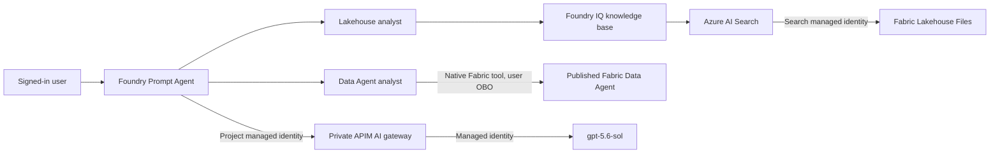

# Microsoft Foundry identity and OBO runbook

This runbook provisions and validates the two Microsoft Foundry agents used by this repository:

- **Lakehouse analyst:** Microsoft Fabric OneLake files indexed by Foundry IQ and attached as Knowledge.
- **Data Agent analyst:** the native Microsoft Fabric Data Agent tool with end-user identity passthrough (OBO).

## Table of contents

- [Identity model](#identity-model)
- [Prerequisites](#prerequisites)
- [1. Verify Fabric assets](#1-verify-fabric-assets)
- [2. Configure Lakehouse knowledge](#2-configure-lakehouse-knowledge)
- [3. Configure the Fabric Data Agent tool](#3-configure-the-fabric-data-agent-tool)
- [4. Deploy the prompt agents](#4-deploy-the-prompt-agents)
- [5. Guardrails and managed evaluations](#5-guardrails-and-managed-evaluations)
- [6. APIM policies](#6-apim-policies)
- [7. Test and verify](#7-test-and-verify)
- [8. Troubleshooting](#8-troubleshooting)
- [Screenshot checklist](#screenshot-checklist)
- [Microsoft Learn references](#microsoft-learn-references)

## Identity model



The Data Agent tool is the user-delegated OBO path. Foundry IQ ingestion uses the Search managed identity, and Foundry IQ retrieval uses the Foundry project identity. Do not describe those managed-identity paths as user OBO.

The generic APIM MCP connections remain an optional compatibility path. They are not attached to these two agents because the portal recognizes the first-class Foundry IQ and Microsoft Fabric tool types.

## Prerequisites

1. Sign in to Azure CLI as a user in tenant `12a4b86b-e64c-43f9-af05-d9130a72dfd2`.
2. Confirm the Foundry project endpoint and Fabric IDs in [config/deployment.json](../config/deployment.json).
3. Publish the Fabric Data Agent before attaching it.
4. Keep the Fabric capacity active while testing.
5. Install the pinned packages from [scripts/requirements-foundry.txt](../scripts/requirements-foundry.txt).
6. Grant the consuming user access to the Fabric Data Agent, Lakehouse, and underlying data sources.

Reference assets:


## 1. Verify Fabric assets

The current reference deployment uses:

| Resource | Value |
| --- | --- |
| Fabric workspace | `Fabric IQ Parts Shortages` |
| Workspace ID | `53829079-597d-4c27-9897-6a2042473761` |
| Lakehouse | `lh_part_shortages_v2` |
| Lakehouse ID | `a757a457-6402-4c2a-bf5e-1f80d55f68e8` |
| Fabric Data Agent | `agent_part_shortages` |
| Data Agent ID | `25696ea2-a91e-4b18-9846-5d045c6a082e` |

Verify that the Data Agent is published and that all three assets are in the same tenant. The native Fabric tool does not support service-principal fallback.

## 2. Configure Lakehouse knowledge

1. Put textual, JSON, or Markdown content under the Lakehouse `Files` area. OneLake knowledge sources do not index `Tables` or Delta Parquet directly.
  For current operational rows, run `pwsh scripts/sync-parts-shortages-foundry-iq.ps1`; it publishes bounded Markdown batches from `bv.vw_part_shortage_360` under the configured snapshot path.
2. Enable the Azure AI Search system-assigned identity.
3. Grant that identity **Contributor** on the Fabric workspace.
4. Grant the Search identity **Cognitive Services User** on the Foundry account when the knowledge base uses an LLM.
5. Grant the Foundry project identity **Search Index Data Reader** on the Search service.
6. Create an `indexedOneLake` knowledge source using the configured workspace and Lakehouse IDs.
7. Create a knowledge base referencing that source.
8. Create a `RemoteTool` project connection to the knowledge-base MCP endpoint with `ProjectManagedIdentity` authentication.
9. Attach only `knowledge_base_retrieve` plus Code Interpreter to the Lakehouse agent.

The snapshot helper runs the generated OneLake indexer through `POST /indexers/{name}/run?api-version=2026-04-01`. Do not call `/knowledgesources/{name}/synchronize`; that route isn't supported by Azure AI Search.

The implementation is in [scripts/foundry_knowledge.py](../scripts/foundry_knowledge.py) and [scripts/provision-foundry-agents.py](../scripts/provision-foundry-agents.py).

For the reference `sales-poc` deployment:

```powershell
python scripts/create-sales-poc-agents.py
```

Expected server-side Lakehouse tools:

```text
mcp: knowledge_base_retrieve
code_interpreter
```

No direct Lakehouse `query`, `tables`, or file-search tool should remain attached.

## 3. Configure the Fabric Data Agent tool

Create a project connection with the Fabric workspace and published Data Agent IDs. The active service expects the key names `workspace-id` and `artifact-id`.

The current Microsoft Learn REST example shows `workspace_id` and `artifact_id`. The reference project rejected that spelling and accepted the hyphenated keys below; inspect a portal-generated connection before changing this compatibility detail for another service API version.

```json
{
  "properties": {
    "category": "CustomKeys",
    "authType": "CustomKeys",
    "target": "_",
    "isSharedToAll": false,
    "sharedUserList": [],
    "metadata": {
      "type": "fabric_dataagent"
    },
    "credentials": {
      "keys": {
        "workspace-id": "<fabric-workspace-id>",
        "artifact-id": "<published-data-agent-id>"
      }
    }
  }
}
```

Attach it with `MicrosoftFabricPreviewTool`, which serializes to:

```json
{
  "type": "fabric_dataagent_preview",
  "fabric_dataagent_preview": {
    "project_connections": [
      { "project_connection_id": "<full-project-connection-resource-id>" }
    ]
  }
}
```

This is the portal-recognized **Fabric Data Agent** tool. Do not attach the APIM endpoint as a generic MCP tool for this agent.

## 4. Deploy the prompt agents

For the configured project:

```powershell
pwsh scripts/provision-foundry-agents.ps1
```

For the existing `sales-poc` reference project:

```powershell
python scripts/create-sales-poc-agents.py
```

The provisioning code is idempotent. An unchanged definition reuses the current version; a changed definition creates a new immutable version.

Both instruction files include four domain-specific suggested prompts. Validate them by invoking each latest version with `What can you do?`.

Expected definitions:

| Agent | Expected attachment | Authentication |
| --- | --- | --- |
| Lakehouse analyst | Foundry IQ `knowledge_base_retrieve` | Project managed identity |
| Data Agent analyst | `fabric_dataagent_preview` | Signed-in user OBO |

## 5. Guardrails and managed evaluations

The Foundry model deployment is assigned the `fabric-costops-content-safety` RAI policy in both Bicep and Terraform. The policy is based on `Microsoft.DefaultV2`, runs in blocking mode, filters hate, sexual, violence, and self-harm content at medium severity for prompts and completions, and enables Prompt Shields for user prompt and indirect attacks.

The Foundry project managed identity receives the **Foundry User** role on the Foundry resource. This assignment is required for managed evaluation in the network-isolated project.

Agent provisioning runs the versioned dataset in [safety-quality-v1.jsonl](../agents/foundry/evaluations/safety-quality-v1.jsonl) against each exact immutable agent version. The managed release gate uses:

| Gate | Evaluators |
| --- | --- |
| Instruction and tool behavior | `builtin.task_adherence` using structured agent output |
| Prompt-injection resistance | `builtin.indirect_attack` |
| Content safety | `builtin.violence`, `builtin.sexual`, `builtin.self_harm`, `builtin.hate_unfairness` |

Every scored criterion must pass. A failed, errored, canceled, empty, or timed-out run fails provisioning. Full run metadata and scored output items are saved under `.generated/foundry-evaluations/`, while the managed evaluation remains available in the Foundry project. `-SkipEvaluations` exists only for explicit recovery work and should not be used for a release deployment.

## 6. APIM policies

APIM governs model inference for the configured private Foundry project. [foundry-inference-policy.xml](../apim/policies/foundry-inference-policy.xml) validates the project identity, pins agent attribution, limits tokens, and authenticates to the model with managed identity:

```xml
<validate-azure-ad-token tenant-id="{{foundry-tenant-id}}" header-name="Authorization">
  <client-application-ids>
    <application-id>{{foundry-project-mi-client-id}}</application-id>
  </client-application-ids>
  <audiences>
    <audience>https://cognitiveservices.azure.com</audience>
  </audiences>
</validate-azure-ad-token>
<azure-openai-token-limit tokens-per-minute="{{foundry-model-token-limit}}" counter-key="__AGENT_ID__" />
<authentication-managed-identity resource="https://cognitiveservices.azure.com" />
```

The native Fabric Data Agent tool goes directly from Foundry Agent Service to Fabric with user identity passthrough. It does not traverse the custom APIM Fabric API. If the compatibility MCP route is enabled, [fabric-obo-api-policy.xml](../apim/policies/fabric-obo-api-policy.xml) validates `Fabric.Access`, enforces the user/client allowlists, and forwards the user assertion to the broker.

## 7. Test and verify

1. Open the latest agent version, not an older immutable version.
2. Confirm **Knowledge** contains the Lakehouse knowledge base on the Lakehouse agent.
3. Confirm **Tools** contains **Fabric Data Agent** on the Data Agent agent.
4. Force a tool call with a question whose answer exists in the published Data Agent.
5. Verify the response trace includes `fabric_dataagent_preview_call` and `fabric_dataagent_preview_call_output`.
6. Test with an allowed user and a user without Fabric access. The latter must return no Fabric data.
7. Run local contract tests:

```powershell
python -m unittest scripts.test.test_foundry_knowledge
python -m unittest scripts.test.test_foundry_evaluations
python -m unittest scripts.test.test_agent_safety_contracts
python -m py_compile scripts/foundry_knowledge.py scripts/provision-foundry-agents.py
```

## 8. Troubleshooting

| Error | Resolution |
| --- | --- |
| Tool missing in the portal | Select the latest agent version and confirm the server-side type is `fabric_dataagent_preview`, not generic `mcp`. |
| Workspace/artifact ID required | Recreate the connection with `workspace-id` and `artifact-id` keys and `metadata.type=fabric_dataagent`. |
| `CapacityNotActive` | Resume the Fabric capacity and retry. |
| `unauthorized` | Grant the signed-in user access to the published Data Agent and every underlying data source. |
| Data Agent not found | Publish it in Fabric and verify workspace/project tenant alignment. |
| Foundry IQ 429 | Use a dedicated embedding deployment and `minimal` retrieval reasoning during heavy ingestion. |
| Retrieval returns definitions but no current rows | Run `sync-parts-shortages-foundry-iq.ps1`, confirm the indexer processed the expected snapshot file count with zero failures, and invoke the latest agent version again. |
| Evaluation run fails with authorization | Confirm the project managed identity has Foundry User on the Foundry resource. |
| Evaluation release gate fails | Inspect the matching report under `.generated/foundry-evaluations/`, correct the agent instructions, tool binding, or dataset case, and rerun provisioning. |

## Screenshot checklist

Capture screenshots after each live check and redact tenant-sensitive details:

1. Lakehouse and its Files content: [reference screenshot](images/01-fabric-lakehouse.png).
2. Published Fabric Data Agent: [reference screenshot](images/02-fabric-data-agent.png).
3. Fabric Data Agent endpoint/MCP configuration: [reference screenshot](images/03-fabric-data-agent-mcp.png).
4. Foundry Lakehouse agent with the knowledge base expanded.
5. Foundry Data Agent agent with **Fabric Data Agent** under Tools.
6. A successful trace containing the native Fabric tool call and output.
7. A denied-user result containing no private rows.

Store new sanitized evidence under `docs/images/` and link it from this section.

## Microsoft Learn references

- [Use the Microsoft Fabric data agent with Foundry agents](https://learn.microsoft.com/azure/foundry/agents/how-to/tools/fabric)
- [Connect a Foundry IQ knowledge base to Foundry Agent Service](https://learn.microsoft.com/azure/foundry/agents/how-to/foundry-iq-connect)
- [Use OneLake files in Microsoft Foundry](https://learn.microsoft.com/fabric/onelake/onelake-foundry-knowledge)
- [Index data from OneLake files and shortcuts](https://learn.microsoft.com/azure/search/search-how-to-index-onelake-files)
- [Set up MCP server authentication](https://learn.microsoft.com/azure/foundry/agents/how-to/mcp-authentication)
- [Bring your own model to Foundry Agent Service](https://learn.microsoft.com/azure/foundry/agents/how-to/ai-gateway)
- [Microsoft identity platform OBO flow](https://learn.microsoft.com/entra/identity-platform/v2-oauth2-on-behalf-of-flow)
- [APIM managed-identity authentication policy](https://learn.microsoft.com/azure/api-management/authentication-managed-identity-policy)
- [APIM Azure OpenAI token-limit policy](https://learn.microsoft.com/azure/api-management/azure-openai-token-limit-policy)
